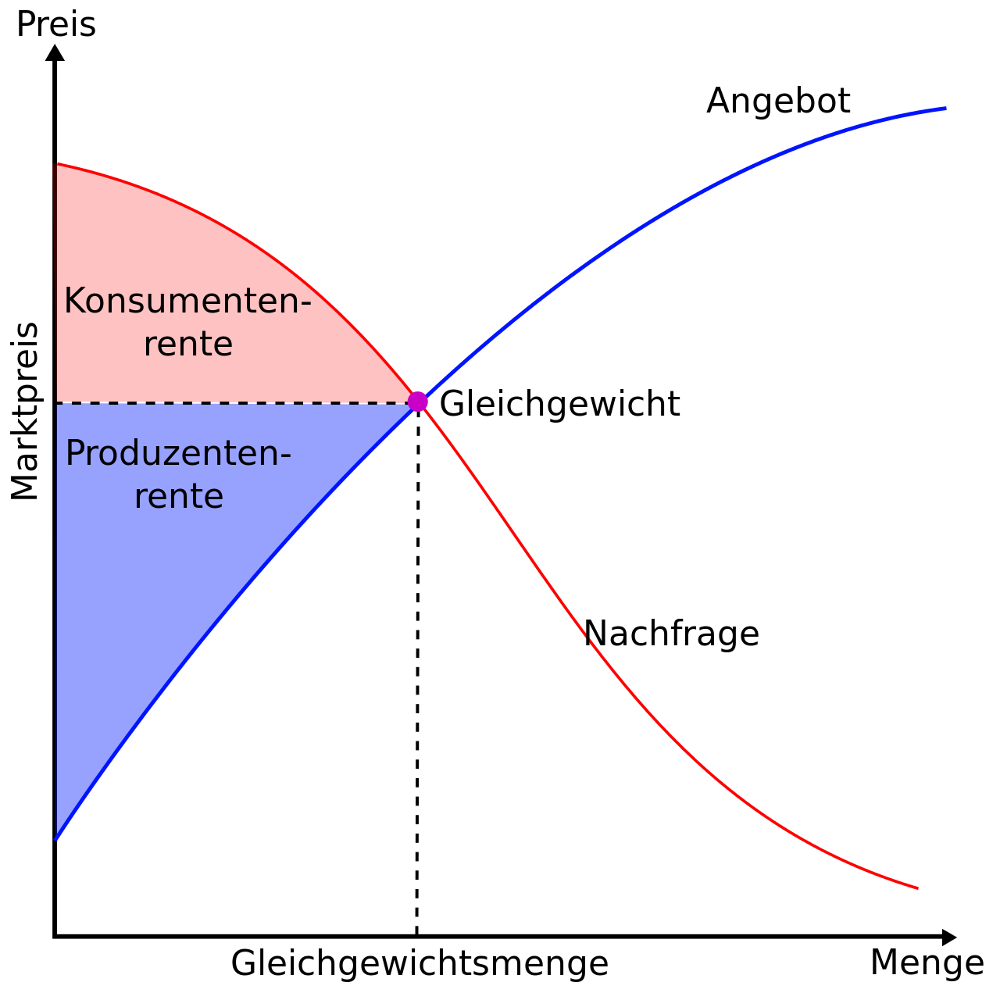

#Fragenkatalog
## Grundlage von Märkten
Fragen aus der Datei [Fragen aus Vorlesung](./Fragenkatalog/00%20Grundlage%20von%20Märkten/Fragen%20aus%20Vorlesung.md).

<b>Beschreiben Sie abstrakt die Aufgaben eines Marktes. Warum existieren Märkte? Was sind Gestaltungsmerkmale von Märkten?</b>

<table><tr><td>
TODO

</td></tr></table>

<b>Was ist eine Angebotsfunktion? Was beeinflusst die Lage und die Form einer Angebotsfunktion?</b>

<table><tr><td>
TODO

</td></tr></table>

<b>Erläutern Sie detailliert die verschiedenen Kosten/Kostenfunktionen. Erläutern Sie einen Wirkungsgrad eines Energiewandlungsprozesses bzw. dessen Form/Verlauf. Beschreiben Sie, wie Sie mithilfe des Wirkungsgrades die Brennstoffkostenfunktion ausgedrückt in Strommengen ableiten (unterstellen Sie einen konstanten Brennstoffpreis). Was bedeutet dieser Verlauf für den Verlauf der Kostenfunktion?</b>

<table><tr><td>
TODO

</td></tr></table>

<b>Sie kommen zu dem Schluss, dass die Kostenfunktion über ein Polynom dritten Grades beschreibbar ist. Berechnen und skizzieren Sie die Grenzkosten und die variablen Durchschnittskosten.</b>

<table><tr><td>
Kostenfunktion: `f(x)=a*x^3 + b*x^2 + c*x + d`

Fixkosten: `d`

Variable Kosten: `a*x^3 + b*x^2 + c*x`

Grenzkosten: `3*a*x^2 + 2*b*x + c` (Ableitung der variablen Kosten)

variable Durchschnittskosten: ???

</td></tr></table>

<b>Was ist eine Nachfragefunktion? Was beeinflusst die Lage und die Form einer Nachfragefunktion?</b>

<table><tr><td>
TODO

</td></tr></table>

<b>Was ist der Gleichgewichtspreis? Charakterisieren Sie den Gleichgewichtspreis in Bezug auf die resultierende volkswirtschaftliche Wohlfahrt.</b>

<table><tr><td>
TODO

</td></tr></table>

<b>Inwiefern mindern Oligopol- als auch Monopolstruktur die Wohlfahrt in einem Markt?</b>

<table><tr><td>
Minderung der Konsumentenrente. Falls es wenige oder nur einen Anbieter gibt, kann dieser den Preis frei bestimmen. Dadurch müssen die Konsumenten/Nachfrager mehr für das Produkt zahlen.
Ein Oligopol oder Monopol kann es auch auf Nachfragerseite geben. Hier würde die Produzentenrente gemindert. Dies ist jedoch in der Energiewirtschaft eher nicht der Fall.

</td></tr></table>

<b>Beschreiben Sie die Rolle / Funktionen von Märkten in der Energiewirtschaft.</b>

<table><tr><td>
TODO 
</td></tr></table>

Fragen aus der Datei [Fragen von GEK](./Fragenkatalog/00%20Grundlage%20von%20Märkten/Fragen%20von%20GEK.md).

<b>Was ist ein natürliches Monopol? Und welche Netze zählen dazu? </b>

<table><tr><td>
"Märkte, die sich natürlicherweise verklumpen /konzentrieren + 1 Anbieter herausbilden, der die Dienstleistung (Netzbetrieb) pro Region anbietet." ~ Borchert

Strom- und Gasnetze zählen als natürliches Monopol, da bei beiden Netzen weitere Mitbewerber hohe Investitionskosten haben und sich der Einstieg nicht lohnt.
Bei Fernwärmenetzen verhält sich das anders. TODO

</td></tr></table>

<b>Was ist die Produzenten- und Konsumentenrente?</b>

<table><tr><td>
Jeweils die Differenz zwischen der Angebots- und Nachfragekurve zum Markträumungspreis.

</td></tr></table>

<b>Was ist der Unterschied zwischen vollständig substiturierbaren Gütern und komplementären Gütern?</b>

<table><tr><td>
**Vollständig substiturierbare Güter**
- Wenn das eine Gut jeweils Ersatz für das andere findet. (z.B. Fisch und Fleisch)
- Eine Preiserhöhung von Gut A kann zu einer Preiserhöhung von Gut B führen.

**Komplementäre Güter** 
- Die Verwendung der Güter ist aneinander gekoppelt. (z.B. Auto und Bezin)
- Ein Anstieg der Bezinpreise kann zu einem Rückgang der Nachfrage nach Autos führen.

</td></tr></table>

<b>Wie sind die Begriffe Elastisch und Unelastisch bei Preiselastizität definiert?</b>

<table><tr><td>
**Elastisch**
- Bei einer Preiserhöhung von 1% (des Angebots) geht die Nachfrage um > 1% zurück.
- Die Nachfrager können auf das Ware verzichten.

**Unelastisch**
- Bei einer Preiserhöhung von 1% (des Angebots) geht die Nachfrage um < 1% zurück.
- Die Nachfrager sind auf die Ware angewiesen.

</td></tr></table>

<b>Definieren Sie Gesamtkosten, Fixkosten, Variable Kosten, Durchschnittskosten und Grenzkosten.</b>

<table><tr><td>

| Bezeichung | Definition |
| ---------- | ---------- |
| Gesamtkosten | Summe aus Fixkosten und variablen Kosten. |
| Fixkosten | Kosten, die **unabhängig** der produzierten Menge anfallen. (z.B. Personalkosten, Wartungskosten) |
| Variable Kosten | Kosten, die **abhängig** der produzierten Menge anfallen. (z.B. Rohstoffkosten) |
| Durchschnittskosten | (auch Stückkosten) Gibt die Kosten je produzierter Einheit an. (Gesamtkosten / Stückzahl = Durchschnittskosten) |
| Grenzkosten | Ableitung der variablen Kosten; Also der Anstieg der variablen Kosten für eine Produktion einer weiteren Einheit. |

</td></tr></table>

<b>Was kann bei Variablen Kosten auftreten?</b>

<table><tr><td>
Skaleneffekte. Je mehr produziert wird, desto günstiger sind die Durchschnittskosten je produzierter Einheit.

</td></tr></table>

<b>Wie errechnet sich das Gewinnmaximum eines Unternehmens?</b>

<table><tr><td>
Wenn der Grenzerlös gleich den Grenzkosten ist.

</td></tr></table>

<b>Wodurch ergibt sich der markträumende Gleichgewichtspreis?</b>

<table><tr><td>
Durch Zusammenführung von Angebots- und Nachfragekurve. Der Schnittpunkt ist der Gleichgewichts- oder markträumenden Preises (MRP).

</td></tr></table>

<b>Wieso bieten Anbieter ihre Angebot an, obwohl die Gesamtkosten ggf. nicht gedeckt werden können?</b>

<table><tr><td>
Solange die variablen Kosten gedeckt sind, lohnt sich ein Handel, da dabei die Fixkosten zumindest anteilig wieder reinkommen. Es ist besser als wenn der Anbieter garnicht handelt und auf den gesamten Fixkosten sitzen bleibt.

</td></tr></table>

<b>Wie sind die Auktionen im Stromhandel aufgebaut?</b>

<table><tr><td>
**Bieterstruktur**
- Einseitig: Es werden entweder nur nachfrage- oder nur angebotsseitig Gebote abgegeben (z.B. Ebay (nur Nachfrageseitig) oder myHammer (nur Angebotsseitig)).
- Zweiseitig: von beiden Seiten werden Kauf- und Verkaufsgebote abgegeben (z.B. Börsen).

**Gebotsabgabe**
- Offen: Der Preis steigt (English Auction) oder fällt (Dutch Auction) mit der Zeit, allen Teilnehmern sind die Gebote der anderen Teilnehmer bekannt (z.B. Auktionshaus).
- Verdeckt: Teilnehmer geben ihre Gebote verdeckt ab.

**Preisbildung**
- Erstpreis/Zweitpreis-auktion: Die Höchstbietenden erhalten den Zuschlag und müssen alle den Preis in Höhe des höchsten/zweithöchsten bezuschlagten Gebots zahlen.
- pay-as-bid: Die Höchstbietenden erhalten den Zuschlag und müssen alle den Preis in Höhe des eigenen Gebots zahlen.

</td></tr></table>

<b>Energiegroßhandelsmärkte haben verschiedene betriebswirtschaftliche und volkwirtschaftliche Funktionen. Benenne diese.</b>

<table><tr><td>
**Volkswirtschaftlicher Funktionen**
- **Allokationsfunktion**: Optimaler Einsatz von Ressourcen.
- **Lenkungsfunktion**: Langfristige Preisanreize für Investitionen in Kraftwerke durch Future-Geschäfte im Terminmarkt.
- **Risikomanagement**: Preisrisiken werden aus dem Markt genommen.

**Betriebswirtschaftliche Funktionen**
- **Hedging**: Absicherung gegen Preisrisiken
- **Optimierung**: Gewinnmaximierung durch Kraftwerkseinsatzoptimierung
- **Arbitrage**: Arbitragegeschäfte zum Ausnutzen von Preisunterschieden in Märkten möglich
- **Spekulation**: Erzielen von GEwinnen durch Spekulation auf Marktentwicklungen möglich

</td></tr></table>

## Spotmärkte
Fragen aus der Datei [Fragen aus Vorlesung](./Fragenkatalog/01%20Spotmärkte/Fragen%20aus%20Vorlesung.md).

<b>Beispielfrage</b>

<table><tr><td>
Beispielantwort

TODO F 3 82 übernehmen
</td></tr></table>

Fragen aus der Datei [Fragen von GEK](./Fragenkatalog/01%20Spotmärkte/Fragen%20von%20GEK.md).

<b>Welche unterschiedlichen Märkte gibt es mit welchen Fristigkeiten? Und wie werden jeweils die Handelsgeschäfte gebildet?</b>

<table><tr><td>
TODO
Folie 3 6
TODO Jeweils dazu schreiben ob Merit-Order oder Pay as bid oder ...
TODO Wozu ist der jeweilige Markt da? 
TODO Handel einsehbar oder verdeckt? (Folie 3 10)
TODO Was wird gehandelt? (Base, Peak, Stunden, Viertelstunden) F 3 13

</td></tr></table>

<b>In welche Segmente ist der Spotmarkt untergliedert?</b>

<table><tr><td>
TODO Folie 3 8

Day Ahead mit Markträumungspreis = Auktion ???

Fortlaufender Handel = ohne Markträumungspreis???

</td></tr></table>

<b>Wie wird am Day-Ahead Markt gehandelt?</b>

<table><tr><td>
TODO F 3 15
TODO Beispiel der Tabelle

</td></tr></table>

<b>Wozu dient Demand-Side-Management (DSM) und welche Möglichkeiten gibt es?</b>

<table><tr><td>
TODO F 3 23

</td></tr></table>

<b>Welche Auftragsarten gibt es beim Intraday Handel?</b>

<table><tr><td>
TODO F 3 31

</td></tr></table>

<b>Was meint Marktkopplung?</b>

<table><tr><td>
TODO 
TODO Kuppelkapazität / Grenzüberschreitende Transportgrenzen

</td></tr></table>

<b>Wie erfolgt der Handel auf verschiedenen Märkten?</b>

<table><tr><td>
TODO F 3 34

</td></tr></table>

<b>Warum können grenzüberschreitende Handelsaktivitäten gewinnbringend sein?</b>

<table><tr><td>
Raumarbitrage. TODO

</td></tr></table>

<b>Auf welchem Markt werden Windräder gehandelt?</b>

<table><tr><td>
Intraday Markt.

</td></tr></table>

<b>Was ist Arbitragehandel?</b>

<table><tr><td>
TODO F3 40
Arbitrage = Zusätzliche Gewinne ohne Risiko abschließen, durch Ausnutzung von Kurs-, Zins-, oder Preisunterschieden.

</td></tr></table>

<b>Welche Regelleistungen gibt es und in welcher Zeit müssen diese verfügbar sein? In welcher Größenordnung fällt diese circa an?</b>

<table><tr><td>
TODO F 3 45/46
TODO F 3 52

</td></tr></table>

<b>Welche Netzfrequenzen sind in Ordnung?</b>

<table><tr><td>
Totband = 49.99 bis 50.01 Hz --> alles ok
47.5 Hz --> Blackout
52.5 Hz --> Oh Wunder, auch Blackout

F3 49

</td></tr></table>

<b>Was versteht man unter Pooling?</b>

<table><tr><td>
F 3 53

</td></tr></table>

<b>Wie erfolgt der Handel von Regelenergie?</b>

<table><tr><td>
F 3 54/ 55 / 56
</td></tr></table>

## Forward und Futuresmärkte
Fragen aus der Datei [Fragen aus Vorlesung](./Fragenkatalog/02%20Forward%20und%20Futuresmärkte/Fragen%20aus%20Vorlesung.md).

<b>Beispielfrage</b>

<table><tr><td>
Beispielantwort
</td></tr></table>

## Operataionsmärkte und Optionsbewertung
Fragen aus der Datei [Fragen aus Vorlesung](./Fragenkatalog/03%20Operataionsmärkte%20und%20Optionsbewertung/Fragen%20aus%20Vorlesung.md).

<b>Beispielfrage</b>

<table><tr><td>
Beispielantwort
</td></tr></table>

## Markteffizienz und Dynamik von Preisen
Fragen aus der Datei [Fragen aus Vorlesung](./Fragenkatalog/04%20Markteffizienz%20und%20Dynamik%20von%20Preisen/Fragen%20aus%20Vorlesung.md).

<b>Beispielfrage</b>

<table><tr><td>
Beispielantwort
</td></tr></table>

## Optionsbewertung und Optionen
Fragen aus der Datei [Fragen aus Vorlesung](./Fragenkatalog/05%20Optionsbewertung%20und%20Optionen/Fragen%20aus%20Vorlesung.md).

<b>Beispielfrage</b>

<table><tr><td>
Beispielantwort
</td></tr></table>

## Organisation des Energiehandels und des Risikomanagements
Fragen aus der Datei [Fragen aus Vorlesung](./Fragenkatalog/06%20Organisation%20des%20Energiehandels%20und%20des%20Risikomanagements/Fragen%20aus%20Vorlesung.md).

<b>Beispielfrage</b>

<table><tr><td>
Beispielantwort
</td></tr></table>

## Operatives Risikomanagement
Fragen aus der Datei [Fragen aus Vorlesung](./Fragenkatalog/07%20Operatives%20Risikomanagement/Fragen%20aus%20Vorlesung.md).

<b>Beispielfrage</b>

<table><tr><td>
Beispielantwort
</td></tr></table>

## Pricing strukturierter Lieferverträge
Fragen aus der Datei [Fragen aus Vorlesung](./Fragenkatalog/08%20Pricing%20strukturierter%20Lieferverträge/Fragen%20aus%20Vorlesung.md).

<b>Beispielfrage</b>

<table><tr><td>
Beispielantwort
</td></tr></table>

