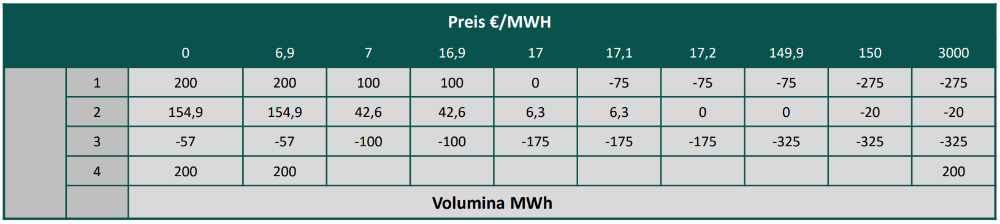
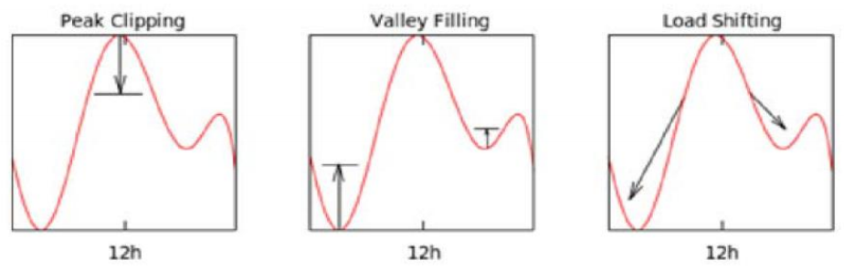
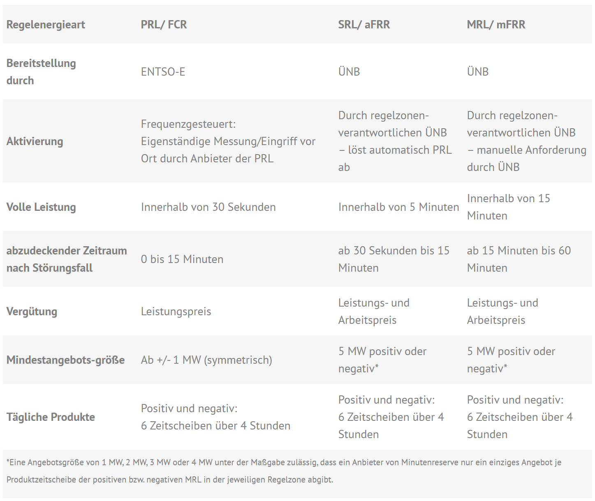

#Fragenkatalog
## Fragentypen je Vorwissen
Fragen aus der Datei [Studiengang](./Fragenkatalog/0%20Fragentypen%20je%20Vorwissen/Studiengang.md).

<b>AMI</b>

<table><tr><td>

- Einflussgrößen Optionspreis
- Regelausgleichsmechanismus
- Optionen Prinzipiell
- Digitalisiesie-rungsfragen Energiewirtschaft (Referat)
- internationaler Handel
- Marktgrundlagen
- Wohlfahrtbeein-flussung durch Marktindifferenzen durch Oligopol oder Monopolstrukturen
- Margiginsystem
- Futures
- Risikofreie Portfolio

</td></tr></table>

<b>Maschinenbauer (eher technisch)</b>

<table><tr><td>

- Märkte Grundlagen
- Angebot und Nachfrage
  - was beeinflusst die Lage
  - was beeinflusst die Form
  - was beeinflusst die Krümmung
  - lineare Funktionen
- empirische identifizierte möglicherweise über empirische ermittelte Näherung an Marktgebote, die man sieht, 
- konvexgeformte, Marktstufen
- Funktionen für die Marktstufen für die unterschiedlichen Aktivitäten:  
  - KW-Management, Vertriebs-/Beschaffungsmanagement
  - Netzmanagement Verlust-Energiebeschaffung
- Forward, Optionen, Fahrpläne <-prinzipielle Merkmale der Produkte
- Grundlegende Frage zum Risiko im Energiehandel

</td></tr></table>

<b>Elektriker</b>

<table><tr><td>

- Märkte
- Wohlfahrt
- Auswirkungen von Marktstrukturen auf Wohlfahrt
  - wie können Mono-pole die Wohlfahrt verändern
- Regelenergiesystem
- Margining (Futures-Teil)
- Rollen
- Funktion und Prozesse im Energiehandel und Risikomanagement

Märkte, Gestaltungsmerkmale von Märkten, Rollen und Funktionen von Märkten, Prozesse, wie ge-he ich an die Märkte (Zugang), Blockgebote, Warum sind Blockgebote für thermische KW oder Spei-cher wichtig (Schemm), Forwardkurven, Idee von Forwardkurven, Strukturenmerkmale von Forward-kurven, Bewegungsformen von Forwardkurven, Risikomanagement allgemein,

</td></tr></table>

<b>Diec</b>

<table><tr><td>

- Kosten
- Kostenfunktion
- Wirkungsgrad (Input/Output-Beziehung)
- Produktionsfunktion
- Kostenfunktion herleiten
- Spot-Intraday-Märkte, die verschiedenen Auktionsverfahren also Preisfindungsverfahren
- Organisatorische Einbettung des Energiehandels
- unterschiedliche Aufgaben
- Rollen
- Funktionen
</td></tr></table>

## Grundlage von Märkten
Fragen aus der Datei [Fragen aus Vorlesung](./Fragenkatalog/00%20Grundlage%20von%20Märkten/Fragen%20aus%20Vorlesung.md).

<b>Beschreiben Sie abstrakt die Aufgaben eines Marktes. Warum existieren Märkte? Was sind Gestaltungsmerkmale von Märkten?</b>

<table><tr><td>

Ein Markt ist ..
- Ansammlung von **Käufern** und **Verkäufern**
- Angebot/Verkauf Produkte
- Preisbestimmung durch Interaktionen der Käufer/Verkäufer 

Warum Märkte?
- Öffnung für alle Nachfrager -> Abschaffung kartellrechtlicher Ausnahmen
- Regulierter, diskriminierungsfreier Zugang
- Verhinderung von natürlichen Monopolen

Gestaltungsmerkmale eines vollkommenen Markts
- **Preisnehmerverhalten**: Die Anzahl an Teilnehmern ist so hoch, dass der Einzelne keinen wesentlichen Einfluss auf den Preis ausüben kann.
- **Produkthomogenität**: Alle Produkte (der verschiedeben Verkäufer) weisen keine relevanten Unterschiede auf. (Vollständige Substituierbarkeit)
- **Freier Markteintritt/austritt**: Barrierefrei + Käufer haben keine Präferenz von wem sie das Produkt kaufen wollen
- **Markttransparenz**: Alle Teilnehmer haben jederzeit Überblick über den gesamten Markt. (Produkte, Preise, Mengen, ...)

F 1 - 12

</td></tr></table>

<b>Was ist eine Angebotsfunktion? Was beeinflusst die Lage und die Form einer Angebotsfunktion?</b>

<table><tr><td>

Lage und Form sind davon beeinflusst wie viele Unternehmer das Produkt zu welchen Preisen anbieten können.

(Hardy)

---
Die Angebotsfunktion beschreibt das Angebot eines Anbieters besteht aus
- **Produktionsfunktion**: Zusammenhang zwischen Input und Output
- **Kostenfunktion**: Produktionsmenge zu anfallenden Kosten

Lagebeziehungen
- Angebotskurve hängt von den Variablen Kosten der jeweiligen Anbieter ab und wird dadurch beeinflusst.
- Nachfragekurve hängt von Einkommen und Zahlungsbereitschaft der Konsumenten ab.

**Formale Ausgestaltung der Angebotsfunktion**
- **Angebot** Führ höhere Marktpreise sind tendenziell mehr Unternehmen bereit zu produzieren. Bei steigenden Preisen **steigt** die angebotene Menge.
- **Nachfrage** Je niedriger der Preis ist, desto höher fällt die nachgefragte Menge aus. Bei steigenden Preisen **sinkt** die nachgefragte Menge. 

F 1 - 23

</td></tr></table>

<b>Erläutern Sie detailliert die verschiedenen Kosten/Kostenfunktionen. Erläutern Sie einen Wirkungsgrad eines Energiewandlungsprozesses bzw. dessen Form/Verlauf. Beschreiben Sie, wie Sie mithilfe des Wirkungsgrades die Brennstoffkostenfunktion ausgedrückt in Strommengen ableiten (unterstellen Sie einen konstanten Brennstoffpreis). Was bedeutet dieser Verlauf für den Verlauf der Kostenfunktion?</b>

<table><tr><td>

Der **Wirkungsgrad eines Energiewandlungsprozesses** ist in der Regel eine umgedrehte quadratische Funktion. (Hardy: "Hügel") Der Wirkungsgrad legt fest, wieviel Brennstoff hinzugefügt werden muss, um eine Outputmenge erreichen zu können. Die produzierte Strommenge ist Brennstoffmenge * Wirkungsgrad. Wobei der Wirkungsgrad nicht konstant ist sondern in Abhängigkeit der Auslastung des Kraftwerks. 

</td></tr></table>

<b>Sie kommen zu dem Schluss, dass die Kostenfunktion über ein Polynom dritten Grades beschreibbar ist. Berechnen und skizzieren Sie die Grenzkosten und die variablen Durchschnittskosten.</b>

<table><tr><td>

Kostenfunktion: `f(x)=a*x^3 + b*x^2 + c*x + d`

Fixkosten: `d`

Variable Kosten: `a*x^3 + b*x^2 + c*x`

Grenzkosten: `3*a*x^2 + 2*b*x + c` (Ableitung der variablen Kosten)

Variable Durchschnittskosten: `(a*x^3 + b*x^2 + c*x) / x = a*x^2 + b*x^1 + c`

F 1 - 23

</td></tr></table>

<b>Was ist eine Nachfragefunktion? Was beeinflusst die Lage und die Form einer Nachfragefunktion?</b>

<table><tr><td>

Gegenfrage: Gilt das für einen Käufer oder den gesamten Markt?

Nachfrage ist von diversen Faktoren abhängig. Grundsätzlich gilt
- Bei höherem Kapital sind Nachfrager tendenziell bereit einen höheren Preis zu bezahlen
- Bei Knappheit des Gutes sind Nachfrager tendenziell bereit einen höheren Preis zu bezahlen
- Bei mehr Angebot zu günstigeren Preisen würden mehr Nachfrager das Produkt kaufen

z.B. F 1 - 33

</td></tr></table>

<b>Was ist der Gleichgewichtspreis? Charakterisieren Sie den Gleichgewichtspreis in Bezug auf die resultierende volkswirtschaftliche Wohlfahrt.</b>

<table><tr><td>

**Merit-Order** Der Schnittpunkt bei Zusammenführen der Nachfrage und Angebotskurve ergibt den markträumenden Preis/Gleichgewichtspreis/Markträumungspreis/... .

_Hinweis: Der Marktpreis ist der Preis den Nachfrager zahlen müssen und Anbieter bekommen. Theoretisch muss dieser nicht bei dem Schnittpunkt sein (z.B. Monopol). Doch wenn es der Schnittpunkt ist (Normalfall), dann wird der auch Gleichgewichtspreis genannt._

Alle Nachfrager müssen den Markträumungspreis zahlen, auch wenn sie vorher mehr Geboten haben. Die Anbieter erhalten den Markträumungspreis, auch wenn sie ihr Produkt günstiger angeboten haben. Jeweils die Differenz zwischen Gebot und Marktpreis wird als Konsumenten- bzw. Produzentenrente bezeichnet. 
Die Wohlfahrt ist als Summe dieser beiden Renten.

TODO Mehr?

</td></tr></table>

<b>Inwiefern mindern Oligopol- als auch Monopolstruktur die Wohlfahrt in einem Markt?</b>

<table><tr><td>

Minderung der Konsumentenrente. Falls es wenige oder nur einen Anbieter gibt, kann dieser den Preis frei bestimmen. Dadurch müssen die Konsumenten/Nachfrager mehr für das Produkt zahlen.
Ein Oligopol oder Monopol kann es auch auf Nachfragerseite geben. Hier würde die Produzentenrente gemindert. Dies ist jedoch in der Energiewirtschaft eher nicht der Fall.

</td></tr></table>

<b>Beschreiben Sie die Rolle / Funktionen von Märkten in der Energiewirtschaft.</b>

<table><tr><td>

**Volkswirtschaftlicher Funktionen**
- **Allokationsfunktion**: Optimaler Einsatz von Ressourcen.
- **Lenkungsfunktion**: Langfristige Preisanreize für Investitionen in Kraftwerke durch Future-Geschäfte im Terminmarkt.
- **Risikomanagement**: Preisrisiken werden aus dem Markt genommen.

**Betriebswirtschaftliche Funktionen**
- **Hedging**: Absicherung gegen Preisrisiken
- **Optimierung**: Gewinnmaximierung durch Kraftwerkseinsatzoptimierung
- **Arbitrage**: Arbitragegeschäfte zum Ausnutzen von Preisunterschieden in Märkten möglich
- **Spekulation**: Erzielen von GEwinnen durch Spekulation auf Marktentwicklungen möglich 

F 1 - 46
</td></tr></table>

Fragen aus der Datei [Fragen von GEK](./Fragenkatalog/00%20Grundlage%20von%20Märkten/Fragen%20von%20GEK.md).

<b>Was ist ein natürliches Monopol? Und welche Netze zählen dazu? </b>

<table><tr><td>

"Märkte, die sich natürlicherweise verklumpen /konzentrieren + 1 Anbieter herausbilden, der die Dienstleistung (Netzbetrieb) pro Region anbietet." ~ Borchert

Strom- und Gasnetze zählen als natürliches Monopol, da bei beiden Netzen weitere Mitbewerber hohe Investitionskosten haben und sich der Einstieg nicht lohnt.
Bei Fernwärmenetzen verhält sich das anders. TODO

</td></tr></table>

<b>Was ist die Produzenten- und Konsumentenrente?</b>

<table><tr><td>

Jeweils die Differenz zwischen der Angebots- und Nachfragekurve zum Markträumungspreis.

</td></tr></table>

<b>Was ist der Unterschied zwischen vollständig substiturierbaren Gütern und komplementären Gütern?</b>

<table><tr><td>

**Vollständig substiturierbare Güter**
- Wenn das eine Gut jeweils Ersatz für das andere findet. (z.B. Fisch und Fleisch)
- Eine Preiserhöhung von Gut A kann zu einer Preiserhöhung von Gut B führen.

**Komplementäre Güter** 
- Die Verwendung der Güter ist aneinander gekoppelt. (z.B. Auto und Bezin)
- Ein Anstieg der Bezinpreise kann zu einem Rückgang der Nachfrage nach Autos führen.

</td></tr></table>

<b>Wie sind die Begriffe Elastisch und Unelastisch bei Preiselastizität definiert?</b>

<table><tr><td>

**Elastisch**
- Bei einer Preiserhöhung von 1% (des Angebots) geht die Nachfrage um > 1% zurück.
- Die Nachfrager können auf das Ware verzichten.

**Unelastisch**
- Bei einer Preiserhöhung von 1% (des Angebots) geht die Nachfrage um < 1% zurück.
- Die Nachfrager sind auf die Ware angewiesen.

</td></tr></table>

<b>Definieren Sie Gesamtkosten, Fixkosten, Variable Kosten, Durchschnittskosten und Grenzkosten.</b>

<table><tr><td>

| Bezeichung | Definition |
| ---------- | ---------- |
| Gesamtkosten | Summe aus Fixkosten und variablen Kosten. |
| Fixkosten | Kosten, die **unabhängig** der produzierten Menge anfallen. (z.B. Personalkosten, Wartungskosten) |
| Variable Kosten | Kosten, die **abhängig** der produzierten Menge anfallen. (z.B. Rohstoffkosten) |
| Durchschnittskosten | (auch Stückkosten) Gibt die Kosten je produzierter Einheit an. (Gesamtkosten / Stückzahl = Durchschnittskosten) |
| Grenzkosten | Ableitung der variablen Kosten; Also der Anstieg der variablen Kosten für eine Produktion einer weiteren Einheit. |

</td></tr></table>

<b>Was kann bei Variablen Kosten auftreten?</b>

<table><tr><td>

Skaleneffekte. Je mehr produziert wird, desto günstiger sind die Durchschnittskosten je produzierter Einheit.

</td></tr></table>

<b>Wie errechnet sich das Gewinnmaximum eines Unternehmens?</b>

<table><tr><td>

Wenn der Grenzerlös gleich den Grenzkosten ist.

</td></tr></table>

<b>Wodurch ergibt sich der markträumende Gleichgewichtspreis?</b>

<table><tr><td>

Durch Zusammenführung von Angebots- und Nachfragekurve. Der Schnittpunkt ist der Gleichgewichts- oder markträumenden Preises (MRP).

</td></tr></table>

<b>Wieso bieten Anbieter ihre Angebot an, obwohl die Gesamtkosten ggf. nicht gedeckt werden können?</b>

<table><tr><td>

Solange die variablen Kosten gedeckt sind, lohnt sich ein Handel, da dabei die Fixkosten zumindest anteilig wieder reinkommen. Es ist besser als wenn der Anbieter garnicht handelt und auf den gesamten Fixkosten sitzen bleibt.

</td></tr></table>

<b>Wie sind die Auktionen im Stromhandel aufgebaut?</b>

<table><tr><td>

**Bieterstruktur**
- Einseitig: Es werden entweder nur nachfrage- oder nur angebotsseitig Gebote abgegeben (z.B. Ebay (nur Nachfrageseitig) oder myHammer (nur Angebotsseitig)).
- Zweiseitig: von beiden Seiten werden Kauf- und Verkaufsgebote abgegeben (z.B. Börsen).

**Gebotsabgabe**
- Offen: Der Preis steigt (English Auction) oder fällt (Dutch Auction) mit der Zeit, allen Teilnehmern sind die Gebote der anderen Teilnehmer bekannt (z.B. Auktionshaus).
- Verdeckt: Teilnehmer geben ihre Gebote verdeckt ab.

**Preisbildung**
- Erstpreis/Zweitpreis-auktion: Die Höchstbietenden erhalten den Zuschlag und müssen alle den Preis in Höhe des höchsten/zweithöchsten bezuschlagten Gebots zahlen.
- pay-as-bid: Die Höchstbietenden erhalten den Zuschlag und müssen alle den Preis in Höhe des eigenen Gebots zahlen.

</td></tr></table>

<b>Energiegroßhandelsmärkte haben verschiedene betriebswirtschaftliche und volkwirtschaftliche Funktionen. Benenne diese.</b>

<table><tr><td>

**Volkswirtschaftlicher Funktionen**
- **Allokationsfunktion**: Optimaler Einsatz von Ressourcen.
- **Lenkungsfunktion**: Langfristige Preisanreize für Investitionen in Kraftwerke durch Future-Geschäfte im Terminmarkt.
- **Risikomanagement**: Preisrisiken werden aus dem Markt genommen.

**Betriebswirtschaftliche Funktionen**
- **Hedging**: Absicherung gegen Preisrisiken
- **Optimierung**: Gewinnmaximierung durch Kraftwerkseinsatzoptimierung
- **Arbitrage**: Arbitragegeschäfte zum Ausnutzen von Preisunterschieden in Märkten möglich
- **Spekulation**: Erzielen von GEwinnen durch Spekulation auf Marktentwicklungen möglich

</td></tr></table>

## Spotmärkte
Fragen aus der Datei [Fragen aus Vorlesung](./Fragenkatalog/01%20Spotmärkte/Fragen%20aus%20Vorlesung.md).

<b>Welche Produkte werden an Energiemärkten gehandelt? Beschreiben Sie die grundsätzlichen Eigenschaften der Produkte.</b>

<table><tr><td>

Auf Energiemärkten werden standardisierte Produkte gehandelt. (Homogene Produkte, die vollständig gegeneinander substituierbar sind.)

</td></tr></table>

<b>Welche Marktstufen werden im Energiemarkt unterschieden? Welche Funktionen übernehmen die Spotmärkte aus folgenden Perspektiven Kraftwerksmanagement, Vertriebs- und Beschaffungsmanagement und Netzmanagement?</b>

<table><tr><td>

Marktstufen
- **Terminhandel**: Grobe Planung des Portfolios zur Risikoabsicherung. Handel erfolgt weit im Vorraus zum Lieferzeitpunkt. 
- **Day-Ahead**: Studenscharfe Optimierung des Portfolios am Vortag des Lieferzeitpunkts.
- **Intraday**: Kurzfristige Portfoliooptimierung/Feinoptimierung kurz vor dem Lieferzeitpunkt. (z.B. bei Kraftwerksausfall oder veränderter Wetterlage) Der Intradayhandel dient auch zur Vermeidung von Ausgleichsenergie.

</td></tr></table>

<b>Beschreiben Sie detailliert anhand eines thermischen Kraftwerks, wie Sie ein Gebot für den Spotmarkt formulieren würden. Welche Relevanz haben Blockgebote für Sie?</b>

<table><tr><td>

Ein thermisches Kraftwerk muss zuerst auf Temperatur kommen, bevor es die volle Leistung einspeisen kann. Ein ständiges Hoch und Runterfahren des Kraftwerks ist aufgrund der längeren Startzeit und den dafür benötigten Brennstoffen nicht wirtschaftlich. Blockgebote ermöglichen es dem Kraftwerksbetreiber das Kraftwerk über mehrere Stunden hinweg laufen zu lassen und dadurch den Einsatz besser zu planen.

</td></tr></table>

<b>Beschreiben Sie genau, wie Anbieter und Nachfrager Gebote an dem Day-Ahead-Spotmarkt abgeben können (Kommunikationsprozess mit der Börse). Wie heißt das an der Börse stattfindende Auktionsverfahren? Welche Vor- und Nachteile hat dieses Verfahren?</b>

<table><tr><td>

TODO

</td></tr></table>

<b>Welche fundamentalen Einflussgrößen auf den Spotpreis sind vorstellbar? Beschreiben Sie detailliert die Wirkung des CO2-Preises auf die merit order.</b>

<table><tr><td>

Die Merit-Order bestimmt den Gleichgewichtspreis und welche Käufer und Verkäufer den Zuschlag erhalten haben. 

Der Verkaufspreis, zu dem Kraftwerke ihre Energie auf dem Markt anbietet, setzt sich aus Brennstoffkosten und CO2 Preisen zusammen. (Variable Kosten) Durch einen hohen CO2 Preis müssen Kraftwerke mit einem hohen CO2 Preis (auch bei günstigen Brennstoffkosten) höhere Verkaufspreise ansetzen. Somit erhalten diese seltener einen Zuschlag bei der Merit Order. --> Kraftwerke mit eventuell höheren Brennstoffkosten dafür geringerem CO2 Ausstoß werden bevorzugt.

</td></tr></table>

<b>Welche Funktion und Bedeutung hat der Intradaymarkt? Vergleichen Sie das Preisbildungsverfahren am Intradaymarkt mit dem des Day-Ahead-Spotmarktes.</b>

<table><tr><td>

TODO

</td></tr></table>

<b>Warum existiert ein europäischer Handel? Was limitiert diesen Handel? Angenommen, Sie müssten eine Investition in eine zwei Marktgebiete verbindende Kuppelkapazität genehmigen, worauf würden Sie achten? Erläutern Sie anhand der beiden Marktdiagramme.</b>

<table><tr><td>

Der länderübergreifende Handel ermöglicht es Raumarbitrage Geschäfte abzuschließen und günstigeren Strom aus dem Ausland zu beziehen. Der Handel ist limitiert durch die Kuppelkapazität, also der maximalen Leistung die durch die Trasse zwischen den beiden Ländern fließen kann, bestimmt. Die Kuppelkapazitäten werden durch die beiden beteiligten ÜNBs in einem Bieterverfahren versteigert.

Bei Ausnutzen von Preisdifferenzen auf beiden Märkten muss deshalb darauf geachtet werden, dass diese Preisdifferenz höher als der Preis für die Kuppelkapazität ist. Sonst wäre es ein Verlustgeschäft.

</td></tr></table>

<b>Erläutern Sie den Regelenergiemarkt. Welche Faktoren beeinflussen die ausgeschriebene Kapazität?</b>

<table><tr><td>

TODO

</td></tr></table>

<b>Erläutern Sie die Funktion des Ausgleichsenergiemechanismus.</b>

<table><tr><td>

TODO
</td></tr></table>

Fragen aus der Datei [Fragen von GEK](./Fragenkatalog/01%20Spotmärkte/Fragen%20von%20GEK.md).

<b>Welche unterschiedlichen Märkte gibt es mit welchen Fristigkeiten? Und wie werden jeweils die Handelsgeschäfte gebildet?</b>

<table><tr><td>

| Markt | Produkte | Preisfindung | Nutzen |
| ----- | -------- | ------------ | ------ |
| Terminhandel | divers | Bilateral | Risikominimierung / Grobe Abstimmung |
| Day-Ahead-Auktion | Stunden und Viertelstunden | Merit-Order | ? | 
| Day-Ahead-Auktion Spot | Stunden und Blockgebote | Merit-Order | ? | 
| Intraday-Auktion | Viertelstunden | Merit-Order | ? |
| Intraday-Handel | Stunden und Viertelstunden | Pay as bid | ? | 

</td></tr></table>

<b>In welche Segmente ist der Spotmarkt untergliedert?</b>

<table><tr><td>

**Day ahead Auktion**
- Handel findet als tägliche Auktion statt.
- Es werden die 24 Stunden des Folgetages gehandelt. Die Produkte sind Blocks, Stunden oder Viertelstunden.
- Merit Order

**Intraday Handel**
-  Kontinuierlicher Handel 
-  Gehandelt wird der gleiche Tag (bis 5 min vor physischer Erfüllung) bzw. der Folgetag.
-  Pay as bid. Die Käufer geben Gebote ab und werden direkt mit einem Käufer "gematcht". Der Handel wird direkt abgeschlossen, falls die Gebote stimmen.

Folie 3 - 8

</td></tr></table>

<b>Was ist die Merit-Order?</b>

<table><tr><td>

Bei einer Auktion geben alle Käufer und Verkäufer verdeckt Gebote ab. Das bedeutet, dass keiner weiß, was die anderen tun.

Nach Abschluss der Auktion wird der Schnittpunkt der Nachfrage- und Angebotskurve ermittelt. (Merit-Order-Verfahren) Der da festgesetzte Preis muss von allen Käufern an die Verkäufer gezahlt werden - unabhängig des vorherigen Gebots.
Die Differenz zwischen Gebot zu Markträumungspreis wird Wohlfahrt genannt. (Konsumtenrente und Produzentenrente)

</td></tr></table>

<b>Wie wird am Day-Ahead Markt gehandelt?</b>

<table><tr><td>

Die Käufer und Verkäufer geben anonym Gebote ab. Dabei geben sie für jede Stunde Paare aus Preis/Volumen ab.

Kaufwünsche = Positive Menge
Verkaufswünsche = Negative Menge

Die Teilnehmer können selbstständig die Preisschritte innerhalb der Preisgrenzen (-500 € und 3000 € pro MWh) festlegen

Darstellung oftmals in Form einer Matrix:
- Zeilen stellen die Stunden dar
- Spalten die Preise
- Mengen in den jeweiligen Kästen

Folie 3 - 15

</td></tr></table>

<b>Wozu dient Demand-Side-Management (DSM) und welche Möglichkeiten gibt es?</b>

<table><tr><td>

DSM dient der Flexibilisierung der Stromnachfrage, um eine optimale Auslastung zu erlangen. Ziel ist vorallem die Nivellierung (Glättung) des Lastgangs für eine optimale Kraftwerksauslastung und die Vermeidung von Lastspitzen.

**Lastmanagementstrategien**
- Peak Clipping: Vermeidung von Lastspitzen
- Valley Filling: Füllen von Niedriglastphasen
- Load Shifting: Verschiebung der Nachfrage von Spitzenlast zu Niedriglastzeiten

Folie 3 - 23

</td></tr></table>

<b>Welche Auftragsarten gibt es beim Intraday Handel?</b>

<table><tr><td>

**Limit Orders**
- Kauf- und Verkaufsgebote mit Preislimit. (Minimaler Verkaufs- oder maximaler Kaufpreis)
- Solche Aufträge werden i.d.R. nicht sofort ausgeführt.

**Market Sweep Order**
- Auftrag mit der Bedingung einer sofortigen vollständigen (oder teilweisen) Ausführung. (IOC)
- Der Auftrag wird sofort ausgeführt - zu dem gerade vorherschenden Preis.

Zusätzlich gibt es noch **Ausführungsbedingungen**, unter denen die Aufträge ausgeführt werden:
- Immediate or cancel (IOC): sofortige vollständige oder teilweise Ausführung des Auftrags 
- Fill-or-kill (FOK): sofortige, vollständige Ausführung des Auftrages.
- All-or-none (AON): vollständige Ausführung des Auftrages, Auftrag verbleibt im Orderbuch

Folie 3 - 31

</td></tr></table>

<b>Was meint Marktkopplung?</b>

<table><tr><td>

Marktkopplung meint den europaweiten Handel über die Ländergrenzen hinweg. Es stehen für solche Handelsgeschäfte aber nur beschränkte Transportkapazitäten zur Verfügung. Diese Kapazitäten werden von dem Übertragungsnetzbetreiber vergeben, damit diese effizient genutzt werrden können. 

Die maximalen Transportkapazitäten an den Ländergrenzen/zwischen den Märkten werden auch Kuppelkapazität genannt.

Folie 3 - 32

</td></tr></table>

<b>Wie erfolgt der Handel auf verschiedenen Märkten?</b>

<table><tr><td>

Es müssen zuerst Transportkapazitäten bei dem ÜNB angefragt werden. Die Kapazitäten werden von dem ÜNB versteigert. Erst wenn man den Zuschlag erhält, kann man auf dem anderen Marktplatz handeln und versuchen durch Arbitragegeschäfte die Preisunterschiede auszunutzen.

Folie 3 - 34

</td></tr></table>

<b>Warum können grenzüberschreitende Handelsaktivitäten gewinnbringend sein?</b>

<table><tr><td>

Raumarbitrage. (Ich kaufe günstigen Strom im Ausland und kann diesen günstig selbst verbrauchen oder auf dem heimischen Strommarkt weiterverkaufen.)

</td></tr></table>

<b>Auf welchem Markt werden Windräder gehandelt?</b>

<table><tr><td>

Intraday Markt, da im Vorfeld unklar ist wieviel Energie produziert wird. 

</td></tr></table>

<b>Was ist Arbitragehandel?</b>

<table><tr><td>

Arbitrage ist die ohne Risiko vorgenommene Ausnutzung von Kurs-, Zins- oder Preisunterschieden zum selben Zeitpunkt mit dem Ziel der Gewinnmitnahme. Im Gegensatz zur Spekulation ist die Arbitrage nicht risikobehaftet.

- Devisenarbitrage
- Differenzarbitrage
- Raumarbitrage
- Zeitarbitrage
- Ausgleichsarbitrage

Folie 3 - 40

</td></tr></table>

<b>Welche Regelleistungen gibt es und in welcher Zeit müssen diese verfügbar sein? In welcher Größenordnung fällt diese circa an?</b>

<table><tr><td>

TODO F 3 45/46
TODO F 3 52

</td></tr></table>

<b>Welche Netzfrequenzen sind in Ordnung?</b>

<table><tr><td>

Totband = 49.99 bis 50.01 Hz --> alles ok
47.5 Hz --> Blackout
52.5 Hz --> Oh Wunder, auch Blackout

F3 49

</td></tr></table>

<b>Was versteht man unter Pooling?</b>

<table><tr><td>

F 3 53

</td></tr></table>

<b>Wie erfolgt der Handel von Regelenergie?</b>

<table><tr><td>

F 3 54/ 55 / 56

</td></tr></table>

<b>Was ist Intrinsic Rolling?</b>

<table><tr><td>

TODO
</td></tr></table>

## Forward und Futuresmärkte
Fragen aus der Datei [Fragen aus Vorlesung](./Fragenkatalog/02%20Forward%20und%20Futuresmärkte/Fragen%20aus%20Vorlesung.md).

<b>Was sind Termingeschäfte? Was ist der Unterschied zwischen bedingten und unbedingten Termingeschäften?</b>

<table><tr><td>

Bei **Termingeschäften** werden vor der Fälligkeit (also vereinbartes Lieferdatum) Lieferbedingungen fest vereinbart. Es gibt verschiedene Arten von Termingeschäften.

| Unbedingte | Bedingte |
| -------- | ---------- |
| Forward | Option auf Forward/Future |
| Future/Swap | |
| Fahrplan | Vollversorgung |

Bei einem **unbedingten** Termingeschäft sind beide Vertragspartner dazu Verpflichtet die Leistung am vereinbarten Termin zu erfüllen.
Ein **bedingtes** Termingeschäft räumt einem der beiden Vertragspartner das Recht ein, das Geschäft verfallen zu lassen. (Optionen) Typischerweise erhält der andere Vertragspartner (ohne das Recht) dafür eine Gebühr. 

</td></tr></table>

<b>Welche Eigenschaften hat ein Forward auf eine Aktie? Wie ist dagegen ein Forward auf eine Energielieferung definiert? </b>

<table><tr><td>

Ein bilateral (OTC) gehandelter, nicht standardisierter Lieferkontrakt zwischen einem Käufer und Verkäufer, bei dem der Käufer zur Abnahme und Bezahlung und der Verkäufer zur Lieferung einer bestimmten Warenmenge zu einem zuvor festgelegten Preis an einem spezifizierten Ort und Datum in der Zukunft verpflichtet ist. (Folie 6 - 9)

Kontrakt-Parameter:
- Menge
- Lieferort (= Bilanzkreis)
- Fälligkeit, d.h. Lieferbeginn und Dauer
- Preis pro MWh

TODO Unterschiede zu Aktien

</td></tr></table>

<b>Definieren Sie einen Strom- oder Gas-Future. Inwiefern unterscheidet sich der Energie-Future vom Energie-Forward?</b>

<table><tr><td>

Bei einem **Future** wird ein fester Preis während der Fälligkeit (Zeitraum Lieferbeginn + Dauer) vereinbart. Die Vertragspartner einigen sich auf einen Preis, der in Zukunft gelten soll. Der tatsächliche Spotmarktpreis wird bei Fälligkeit aber abweichen. Die Differenz zum Spotmarktpreis wird als Finanzausgleich zwischen den Vertragspartnern gezahlt.

Kontrakt-Parameter:
- Konstante Leistung
- Lieferort (= Bilanzkreis)
- Fälligkeit, d.h. Lieferbeginn und Dauer
- Preis pro MWh

</td></tr></table>

<b>Grenzen Sie den Forward zum Fahrplan ab. Inwiefern haben Lieferverträge Flexibilitäten? Inwiefern kann man hier von Option sprechen?</b>

<table><tr><td>

Ein Forward garantiert eine konstante Leistung über einen defizierten Zeitraum. Bei einem **Fahrplan** wird eine Leistungsstruktur vereinbart.

Kontrakt-Parameter:
- Beliebige Leistungszeitreihe in einer bestimmten Auflösung (z.B. stündlich)
- Lieferort (= Bilanzkreis)
- Fälligkeit, d.h. Lieferbeginn und Dauer
- Preis pro MWh

</td></tr></table>

<b>Was bedeutet Hedging? Erläutern Sie ausführlich das Konzept.</b>

<table><tr><td>

TODO

</td></tr></table>

<b>Was bedeutet Arbitrage? Was bedeutet und impliziert ein arbitragefreier Markt?</b>

<table><tr><td>

**Arbitrage** meint das risikofreie Ausnutzen von Kurs-, Zins- oder Preisunterschieden zu einem Zeitpunkt. Es werden zwei Handelsgeschäfte (Kauf und Verkauf von Energie), die zusammen einen Gewinn bringen, zeitgleich abgeschlossen. Anders als bei Spekulationen ist dies wirklich Risikofrei!

Arten von Arbitrage
- **Raumarbitrage** Ausnutzen von Preisunterschieden auf unterschiedlichen Handelsplätzen. (z.B. Deutschland und Frankreich)
- **Zeitarbitrage** Ausnutzen von Preisunterschieden zu unterschiedlichen Zeitpunkten. (benötigt Speicher)
- **Ausnutzen von Kursdifferenzen** durch Kauf und Verkauf eines Produkts. (z.B. Stundenprodukt kaufen und die vier Viertelstunden verkaufen)

</td></tr></table>

<b>Beschreiben Sie ein offenes Orderbuch. Inwiefern gilt hier die Preisregel pay as bid?</b>

<table><tr><td>

Bei einem **offenen Orderbuch** werden Kauf und Verkaufsgebote anonym (man weiß also nicht von wem die Gebote sind) gegenübergestellt.

Sobald der Kaufpreis eines Gebots größer gleich dem gewünschten Verkaufspreis liegt, kommt es zu einem Geschäftsabschluss. Die beiden Aufträge werden aus dem Orderbuch entfernt.
Der Käufer muss den von ihm gebotenen Kaufpreis zahlen.

</td></tr></table>

<b>Was ist eine Forward- bzw. Futurekurve? </b>

<table><tr><td>

Die Kurven zeigen, wie sich die Preise in der nächsten Zeit entwickeln könnten.

</td></tr></table>

<b>Beschreiben Sie eine mark to market. Definieren Sie Normal Backwardation und Contango.</b>

<table><tr><td>

Bei **market-to-market** werden die Handelsgeschäfte nach Abschluss neu bewertet. Der Wert ist hierbei ungefähr null. (????)

Normal Backwardtion und Contango sind zwei Preissituationen bei Warentermingeschäften. Bei Ersterem liegt der Preis unter dem erwarteten Spotpreis, bei Zweiterem drüber.

TODO

</td></tr></table>

<b>Wann ist eine Forwardkurve in Normal Backwardation, wann in Contango?</b>

<table><tr><td>

Wenn der Spotpreis **unter** dem im Forward festgesetzten Preis liegt, ist es in Normal Backwardation.

Wenn der Spotpreis **über** dem im Forward festgesetzten Preis liegt, ist es in Contango.

</td></tr></table>

<b>Beschreiben Sie das Margining-System an der EEX. Welchem Zweck dient dieses?</b>

<table><tr><td>

TODO
</td></tr></table>

Fragen aus der Datei [Fragen von GEK](./Fragenkatalog/02%20Forward%20und%20Futuresmärkte/Fragen%20von%20GEK.md).

<b>Welche Arten von Termingeschäften gibt es?</b>

<table><tr><td>

- physische Erfüllung / Forward - Preis sichern für zukünftige Lieferung
- finanzielle Erfüllung / Future - 
- Wahlrecht / Option - entweder man kauft oder lässt es verfallen

TODO F 6 - 6

</td></tr></table>

<b>Wann ist die Fälligkeit der Zahlungen bei Future und Forward?</b>

<table><tr><td>

Bei Forward wird die Zahlung am Schluss getätigt. (Käufer braucht hohe Bonität)

Ein Future findet die Zahlung fortlaufend/direkt statt. 

</td></tr></table>

<b>Forward: Was? Zwischen wem? Inhalt? </b>

<table><tr><td>

TODO
F 6 - 9

</td></tr></table>

<b>Fahrplan: Was? Zwischen wem? Inhalt? </b>

<table><tr><td>

TODO
F 6 - 10

</td></tr></table>

<b>Future: Was? Zwischen wem? Inhalt? </b>

<table><tr><td>

TODO
F 6 - 11

</td></tr></table>

<b>Welche Vorteile haben die Termingeschäfte für Käufer und Verkäufer?</b>

<table><tr><td>

- Sicherung von Preisen
- Sicherung von Abnahmemengen

</td></tr></table>

<b>Wieso ist eine Option ein asymmetrisches Produkt?</b>

<table><tr><td>

Käufer und Verkäufer haben nicht die gleichen Rechte.

F 6 - 17

</td></tr></table>

<b>Was ist eine europäische Option oder amerikanische Option?</b>

<table><tr><td>

Europäische Option kann in einem bestimmten **Zeitpunkt** ausgelöst werden. Eine amerikanische Option in einem bestimmten **Zeitraum**.

</td></tr></table>

<b>Was meint Hedging, Arbitrage und Spekulation?</b>

<table><tr><td>

TODO 
F 6 - 25

</td></tr></table>

<b>Was sind Market Maker?</b>

<table><tr><td>

Sicherstellen von Gleichgewicht zwischen Angebot und Nachfrage.
TODO Googlen wie das funktioniert
TODO F 6 - 31

</td></tr></table>

<b>Was sind Settlement Preise?</b>

<table><tr><td>

TODO 
F 6 - 32

</td></tr></table>

<b>Was sind langfristige und kurzfristige Faktoren?</b>

<table><tr><td>

TODO F 6 - 49

</td></tr></table>

<b>Welchen Einfluss haben langfrisitge und kurzfristige Faktoren?</b>

<table><tr><td>

TODO F 6 - 49

</td></tr></table>

## Operataionsmärkte und Optionsbewertung
Fragen aus der Datei [Fragen aus Vorlesung](./Fragenkatalog/03%20Operataionsmärkte%20und%20Optionsbewertung/Fragen%20aus%20Vorlesung.md).

<b>Beschreiben und charakterisieren Sie Optionen in der Energiewirtschaft.</b>

<table><tr><td>

In der Energiewirtschaft gibt es verschiedene Optionen:
- Optionen auf Futures
- Optionen auf Spotpreise (Forward)
- Optionen in Lieferverträgen
- Optionen auf Wetter

Nochmal anders motiviert: In der Energiewirtschaft gibt es viele Kraftwerke (Assets), die ganz flexibel eingesetzt werden können. Entweder das Kraftwerk läuft, wenn es sich rentieren würde, oder eben nicht. Diese Flexibilität kann auch als Option formuliert werden.

F 08 - 7ff.

</td></tr></table>

<b>Beschreiben Sie die Auszahlungsprofile einer Option? Warum sind die Auszahlungsprofile so geformt?</b>

<table><tr><td>

TODO

</td></tr></table>

<b>Warum muss eine Option einen positiven Preis haben? Beschreiben Sie aus ökonomischer Sicht.</b>

<table><tr><td>

Der Käufer kauft sich ein Wahlrecht. (Option ausüben oder nicht) Dieses Recht muss etwas kosten. Es wäre für den Verkäufer sinnlos Rechte abzutreten und dafür auch noch Geld zu zahlen.

F 8 - 13

</td></tr></table>

<b>Welche Spezifikationen hat eine Option? Wie unterscheiden sich europäische und amerikanische Optionen?</b>

<table><tr><td>

**Europäische Option**
Option kann **zu einem bestimmten Zeitpunkt** eingelöst werden oder nicht.

**Amerikanische Option**
Option kann **über einen Zeitraum** eingelöst werden oder nicht.

**Spezifikationen**
- Verfalltermin
- Basis- bzw. Ausübungspreis
- Spezielle Terminologien
- Positionsgrenzen

</td></tr></table>

<b>Beschreiben Sie die Einflussgrößen auf einen Optionspreis und die Art der Wirkung.</b>

<table><tr><td>

TODO

</td></tr></table>

<b>Erklären Sie die put-call-Parität. Was sagt sie aus? Warum gilt sie? </b>

<table><tr><td>

Die Put-Call-Parität gilt nur für europäische Optionen. Die put-call-Parität besagt, dass zwischen Put und Call Optionen eine feste Beziehung besteht. Dadurch können die Preise jeweils voneinander abgeleitet werden.

Damit das funktioniert, müssen sowohl Put als auch Call Option sich auf den gleichen Basiswert beziehen

F 8 - 13

</td></tr></table>

<b>Skizzieren und erläutern Sie die Wertgrenzen eines europäischen calls.</b>

<table><tr><td>

TODO

</td></tr></table>

<b>Erklären Sie den Sinn der Bildung eines risikoneutralen Portfolios. Welche Konsequenzen hat dieses für die Bewertung der Option?</b>

<table><tr><td>

TODO

</td></tr></table>

<b>Erklären Sie den Optionspreis in einem Einperioden-Baum. Erklären Sie die „Wahrscheinlichkeiten“ p. </b>

<table><tr><td>

TODO

</td></tr></table>

<b>Bei der Verwendung von p wurde erläutert, dass diese Wahrscheinlichkeiten in der risikoneutralen Welt darstellen. Welches Wachstum der Basiswerte implizieren diese Wahrscheinlichkeiten? Erklären Sie hieran die Transformation der realen Welt in eine risikofreie.</b>

<table><tr><td>

TODO

</td></tr></table>

<b>Wie und warum lassen sich die Parameter der Binomialverteilung aus Marktdaten errechnen?</b>

<table><tr><td>

TODO

</td></tr></table>

<b>Was ist ein Delta? Wieso muss man das Delta von Zeitschritt zu Zeitschritt anpassen? Erläutern Sie den resultierenden Handel (das Delta-Hedging).</b>

<table><tr><td>

TODO

</td></tr></table>

Fragen aus der Datei [Fragen von GEK](./Fragenkatalog/03%20Operataionsmärkte%20und%20Optionsbewertung/Fragen%20von%20GEK.md).

<b>Welche Optionen werden im Energiemarkt gehandelt?</b>

<table><tr><td>

- Option auf Futures
- Option in Lieferverträgen
- Option auf Spotpreise
- Option auf Wetter

F 8 - 7

</td></tr></table>

<b>Welche physischen Assets weisen Optionscharakter auf?</b>

<table><tr><td>

**Kraftwerke** können laufen oder aber nicht. Option auf clean spread.

**Speicher** können Ausspeichern oder nicht. Option auf Kalender-Spread.

Könnnen auch als Realoptionen bezeichnet werden.

F 8 - 8

</td></tr></table>

<b>Was ist der faire Preis einer Option?</b>

<table><tr><td>

TODO F 8 - 12

</td></tr></table>

<b>Was sind die Spezifikationen von Optionen?</b>

<table><tr><td>

- Verfalltermin
- Basis- bzw. Ausübungspreis
- Spezielle Terminologien
- Positionsgrenzen

F 8 - 17

</td></tr></table>

<b>Was ist der Unterschied zwischen einer europäischen und amerikanischen Option?</b>

<table><tr><td>

TODO F 8 - 19

</td></tr></table>

<b>Nennen Sie die Werttreiber einer europäischen Call Option.</b>

<table><tr><td>

- Volatilität (+)
- Aktueller Kurs des Basiswerts (+)
- Risikoloser Zins (+)
- Dividenden (-)
- Basispreis (-)
- Restlaufzeit (?)

TODO F 8 - 20 das ganze Diagramm verstehen

</td></tr></table>

## Markteffizienz und Dynamik von Preisen
Fragen aus der Datei [Fragen aus Vorlesung](./Fragenkatalog/04%20Markteffizienz%20und%20Dynamik%20von%20Preisen/Fragen%20aus%20Vorlesung.md).

<b>Beispielfrage</b>

<table><tr><td>

Beispielantwort
</td></tr></table>

Fragen aus der Datei [Fragen von GEK](./Fragenkatalog/04%20Markteffizienz%20und%20Dynamik%20von%20Preisen/Fragen%20von%20GEK.md).

<b>Was ist Informationseffizienz und welche Arten gibt es?</b>

<table><tr><td>

TODO 
F 9 - 7

</td></tr></table>

<b>Ich mag diesen Foliensatz nicht :( </b>

<table><tr><td>

TODO F 9 - 22
</td></tr></table>

## Optionsbewertung und Optionen
Fragen aus der Datei [Fragen aus Vorlesung](./Fragenkatalog/05%20Optionsbewertung%20und%20Optionen/Fragen%20aus%20Vorlesung.md).

<b>Beispielfrage</b>

<table><tr><td>

Beispielantwort
</td></tr></table>

Fragen aus der Datei [Fragen von GEK](./Fragenkatalog/05%20Optionsbewertung%20und%20Optionen/Fragen%20von%20GEK.md).

<b>Beispielfrage</b>

<table><tr><td>

TODO 
F 10 -
</td></tr></table>

## Organisation des Energiehandels und des Risikomanagements
Fragen aus der Datei [Fragen aus Vorlesung](./Fragenkatalog/06%20Organisation%20des%20Energiehandels%20und%20des%20Risikomanagements/Fragen%20aus%20Vorlesung.md).

<b>Beispielfrage</b>

<table><tr><td>

Beispielantwort
</td></tr></table>

